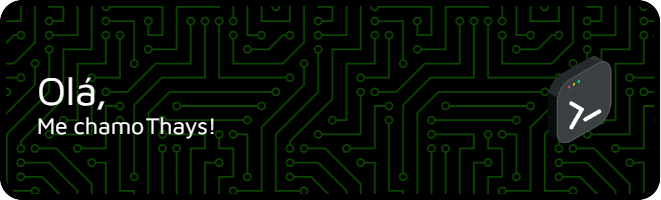

## 👩‍💻 Sobre Mim
🎓 Cursando **Análise e Desenvolvimento de Sistemas** no IFSC/SJ  
⚡ Entusiasta de **Eletrônica** – atualmente explorando **Arduino**!   
🖥️ Estudando **Aprendizado de Máquina**, **Serviços em Nuvem** e **Dispositivos Móveis**

## ⚙️ Skills

### 💻 Linguagens & Techs

### 🛠️ Ferramentas & Plataformas

